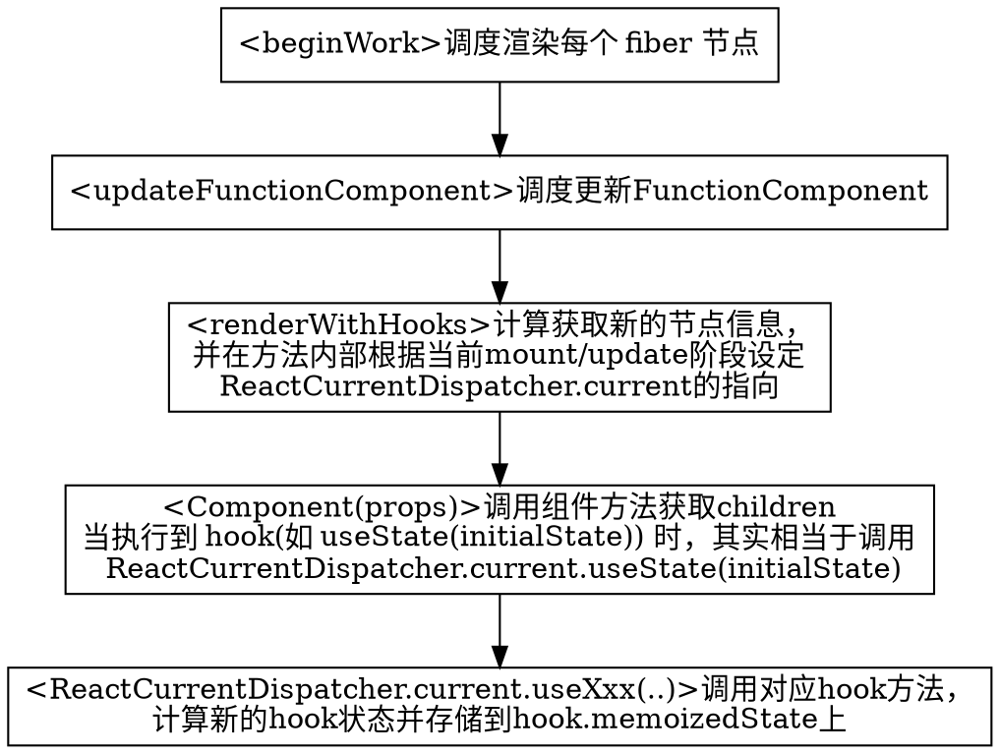

## 定义

在[官方文档](https://zh-hans.reactjs.org/docs/hooks-intro.html)中可以查阅 hooks 的介绍和规则。

在 16.8 之前，其实 React 已经有了 `FunctionComponent` ，不过在之前的 `FunctionComponent` 中，无法使用类似 `ClassComponent` 中的 `state`，`Lifecycle`等特性，使用场景有限。

在 `ClassComponent` 中，可以将 `state` 挂载到实例上，可是在 `FunctionComponent` 执行完后，就退出了当前执行的作用域，那么 hooks 是如何做到保存状态的呢？

提及缓存 function 中的值，常见的有两种方式，一种是使用全局变量存储值，另一种是使用闭包存储。

## hooks 调用过程

在调度节点渲染的方法中，当遇到节点类型为 `FunctionComponent` 时，会通过 `renderWithHooks` 方法计算得出新节点的页面信息。



下面看一个相对比较简单的 `useRef` 方法的源码：

```js
function mountRef<T>(initialValue: T): {| current: T |} {
  const hook = mountWorkInProgressHook()
  const ref = { current: initialValue }
  hook.memoizedState = ref
  return ref
}

function updateRef<T>(initialValue: T): {| current: T |} {
  const hook = updateWorkInProgressHook()
  return hook.memoizedState
}

function mountWorkInProgressHook(): Hook {
  const hook: Hook = {
    memoizedState: null,

    baseState: null,
    baseQueue: null,
    queue: null,

    next: null,
  };

  if (workInProgressHook === null) {
    // This is the first hook in the list
    currentlyRenderingFiber.memoizedState = workInProgressHook = hook;
  } else {
    // Append to the end of the list
    workInProgressHook = workInProgressHook.next = hook;
  }
  return workInProgressHook;
}

```

在 `mount` 阶段，通过 `mountWorkInProgressHook` 构建了一个初始状态的 hook ，如果指向当前 fiber 的 `workInProgressHook` 为 `null` 时，意味着当前 fiber 没有 hook 队列。所以创建一个新的 hook 将 `fiber.memoizedState` 指向刚创建的新的 hook。当 `workInProgressHook` 不为 `null` 时，意味着新创建的 hook 需要插入的已经存在的 hook 队列的尾部。

```ts
function updateWorkInProgressHook(): Hook {
  let nextCurrentHook: null | Hook; // 页面当前 hook
  if (currentHook === null) { // 没有更新时
    const current = currentlyRenderingFiber.alternate;
    if (current !== null) {
      nextCurrentHook = current.memoizedState;
    } else {
      nextCurrentHook = null;
    }
  } else {
    nextCurrentHook = currentHook.next;
  }

  let nextWorkInProgressHook: null | Hook;
  if (workInProgressHook === null) {
    nextWorkInProgressHook = currentlyRenderingFiber.memoizedState;
  } else {
    nextWorkInProgressHook = workInProgressHook.next;
  }

  if (nextWorkInProgressHook !== null) {
    // There's already a work-in-progress. Reuse it.
    workInProgressHook = nextWorkInProgressHook;
    nextWorkInProgressHook = workInProgressHook.next;

    currentHook = nextCurrentHook;
  } else {
    // Clone from the current hook.
    currentHook = nextCurrentHook;

    const newHook: Hook = {
      memoizedState: currentHook.memoizedState,

      baseState: currentHook.baseState,
      baseQueue: currentHook.baseQueue,
      queue: currentHook.queue,

      next: null,
    };

    if (workInProgressHook === null) {
      // This is the first hook in the list.
      currentlyRenderingFiber.memoizedState = workInProgressHook = newHook;
    } else {
      // Append to the end of the list.
      workInProgressHook = workInProgressHook.next = newHook;
    }
  }
  return workInProgressHook;
}
```

在 `update` 阶段，通过 `updateWorkInProgressHook` 获取当前 hook 并返回该 hook 的值 `hook.memoizedState`。在这个方法里，通过判断区分出是由用户触发的更新还是由更新触发的更新<sup>待补充</sup>，并返回最终正确的 hook。

