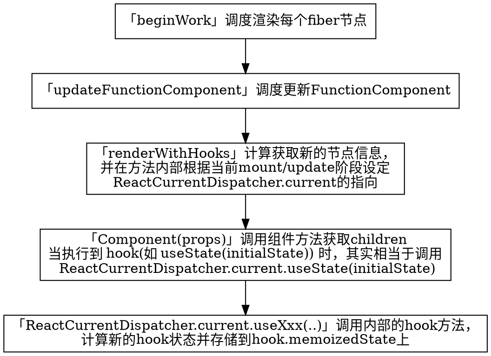

## 基本概念

在[官方文档](https://zh-hans.reactjs.org/docs/hooks-intro.html)中可以查阅 hooks 的介绍和规则。

在 16.8 之前，其实 React 已经有了 `FunctionComponent` ，不过在之前的 `FunctionComponent` 中，无法使用类似 `ClassComponent` 中的 `state`，生命周期等特性，所以大多数情况下，开发者都不使用 `FunctionComponent`。

在 `ClassComponent` 中，可以将 `state` 挂载到实例上，可是在 `function` 执行完后，就退出了当前执行的作用域，那么 hooks 是如何做到保存组件状态的呢？

提及缓存方法中的值，大多有两种方式，一种是使用全局变量存储值，另一种是使用闭包存储。

在 hooks 中，其实两种方式都有使用到，下面我们来看看 hooks 的实现。

## hooks 实现

在调度节点渲染的方法中，当遇到 `FunctionComponent` 时，会通过 `renderWithHooks` 方法计算得出新节点的页面信息。



下面看一个相对比较简单的 useRef 方法的源码：

```js
function mountRef<T>(initialValue: T): {| current: T |} {
  const hook = mountWorkInProgressHook()
  const ref = { current: initialValue }
  hook.memoizedState = ref
  return ref
}

function updateRef<T>(initialValue: T): {| current: T |} {
  const hook = updateWorkInProgressHook()
  return hook.memoizedState
}
```

在 mount 阶段，通过 `mountWorkInProgressHook` 构建了一个初始状态的 hook 并将赋值给 `fiber.memoizedState`。在 update 阶段，通过 `updateWorkInProgressHook` 获取当前 hook 并返回该 hook 的值 `hook.memoizedState`。通过将状态存储在对应 `fiber.memoizedState`，可以认为将状态存储在了全局变量上，通过获取对应 fiber 的对应 hook 的 `memoizedState` 可以获取到存储的值。

