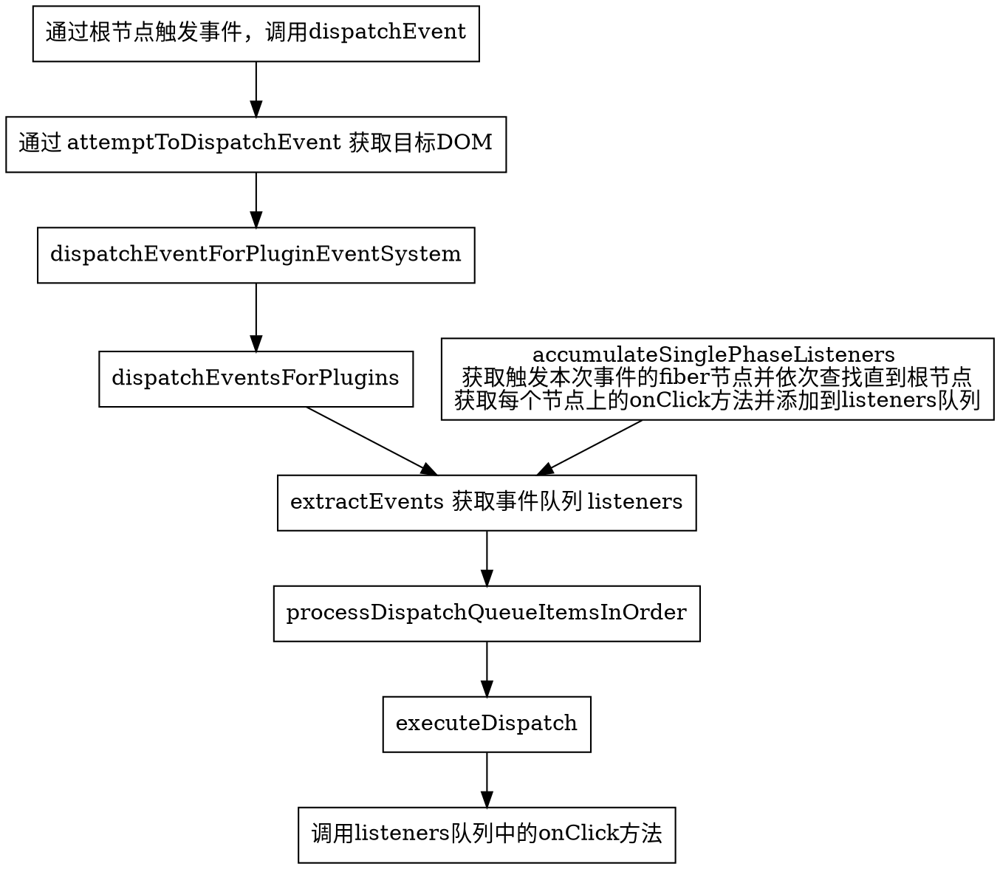

> React 17.0.2

React 在[文档](https://zh-hans.reactjs.org/docs/handling-events.html)中提到：

> SyntheticEvent 实例将被传递给你的事件处理函数，它是浏览器的原生事件的跨浏览器包装器。

在 React 中，并不像 DOM 一样在各个节点上注册事件，而是在根节点监听事件。

针对合成事件的处理可以理解为两个阶段：

1. 在根节点 fiberRoot 上添加事件监听
2. 在节点上触发事件

## 在根节点上添加事件监听

在构建 `fiberRoot` 时，不论 `legacy` 模式还是 `concurrent` 模式，都通过 `ReactDOMLegacyRoot` 或 `ReactDOMRoot` 构建。并通过 `listenToAllSupportedEvents` 为 `fiberRoot` 添加事件监听，同时对部分特殊事件有特别的处理逻辑。

```js
function createRootImpl(
  container: Container,
  tag: RootTag,
  options: void | RootOptions
) {
  // ...

  // 对根节点添加监听事件
  listenToAllSupportedEvents(rootContainerElement)

  return root
}

function listenToAllSupportedEvents(rootContainerElement: EventTarget) {
  if (!(rootContainerElement: any)[listeningMarker]) {
    ;(rootContainerElement: any)[listeningMarker] = true

    allNativeEvents.forEach(domEventName => {
      if (domEventName !== "selectionchange") {
        if (!nonDelegatedEvents.has(domEventName)) {
          listenToNativeEvent(domEventName, false, rootContainerElement)
        }
        // listenToNativeEvent 是对 addEventListener 的封装
        // 可以理解为 addEventListener
        listenToNativeEvent(domEventName, true, rootContainerElement)
      }
    })
    // ...
  }
}

// listenToNativeEvent -> addTrappedEventListener
function addTrappedEventListener(
  targetContainer: EventTarget,
  domEventName: DOMEventName,
  eventSystemFlags: EventSystemFlags,
  isCapturePhaseListener: boolean,
  isDeferredListenerForLegacyFBSupport?: boolean
) {
  let listener = createEventListenerWrapperWithPriority(
    targetContainer,
    domEventName,
    eventSystemFlags
  )

  // ...

  unsubscribeListener = addEventBubbleListener(
    targetContainer,
    domEventName,
    listener
  )
}
```

而绑定到事件的回调函数，根据事件优先级的不同设置不同的回调函数(默认为 `dispatchEvent`)，并返回作为 `listener` 绑定到根节点上。

`React DOM` 会在初始化的时候，调用各种 `EventPlugin.registerEvents` 来注册当前环境（浏览器）应该处理的事件名称。

```js
SimpleEventPlugin.registerEvents()
EnterLeaveEventPlugin.registerEvents()
ChangeEventPlugin.registerEvents()
SelectEventPlugin.registerEvents()
BeforeInputEventPlugin.registerEvents()
```

经过处理后的 `registrationNameDependencies` 记录了当前环境 `SyntheticEvent` 对应的 `NativeEvent` 映射关系。

```js
registrationNameDependencies = {
  // ...
  onChange: [
    "change",
    "click",
    "focusin",
    "focusout",
    "input",
    "keydown",
    "keyup",
    "selectionchange",
  ],
  onChangeCapture: [
    "change",
    "click",
    "focusin",
    "focusout",
    "input",
    "keydown",
    "keyup",
    "selectionchange",
  ],
  onClick: ["click"],
  onClickCapture: ["click"],
  // ...
}
```

## 设置监听后，触发事件

经过 `listenToAllSupportedEvents` 方法处理后，任何在根节点内触发的被当前运行环境支持的事件，都会对应的事件的监听函数。以 `click` 事件为例：


