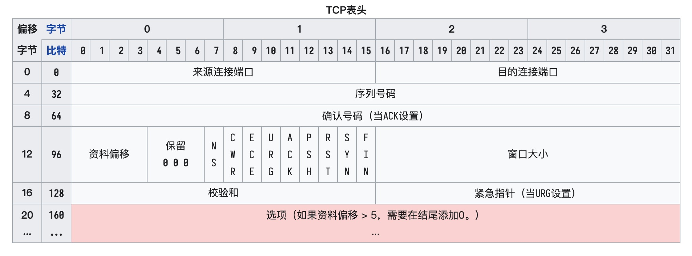

## 前言

每每说起原理，往往令人望而却步，总觉得原理是一个深奥难懂的底层知识。最近有种豁然开朗的感受，正如曾经中学时代对于牛顿三大定律的理解一样，听上去原理是一个极其复杂的知识，但结合实际去思考其实它可能很简单易懂。

比如第二定律的“原理”是：物体加速度的大小跟作用力成正比，跟物体的质量成反比，且与物体质量的倒数成正比；加速度的方向跟作用力的方向相同。而描述第二定律的“代码实现”是： `∑F=kma`。我们可以又可以将这个原理应用到“实际业务”中，比如计算加速度等现实问题。

## 浏览器的组成

浏览器的主要功能就是用户向服务器发出请求，在浏览器窗口中展示选择的网络资源。资源的位置由用户使用 URI（统一资源标示符）指定。

### 架构

现代浏览器基本已经从单进程发展成多进程的应用，每个标签页都属于一个独立的进程，同时浏览器的主进程、渲染、网络等也属于各自独立的进程。独立进程的好处是安全、稳定、流畅，但同样带来占用资源高的缺点。

### 渲染引擎

### 流程

浏览器的主要工作流程：

1. 导航
   1. DNS 查找
   2. TCP 握手
   3. TLS 协商
   4. 响应
   5. TCP 慢开始/14kb 规则
   6. 拥塞控制
2. 解析
   1. 构建 DOM 树
   2. 预加载扫描器
   3. 构建 CSSOM 树
   4. 处理脚本
3. 渲染
   1. Style
   2. Layout
   3. Paint
   4. Compositing

#### 1. 导航

##### 1.1 浏览器缓存

HTTP1.1 通过 Cache-Control 设置缓存策略，通过响应头携带不同的头字段及参数设置不同的缓存策略，常见的策略如下：

1. 设置 `max-age=x(seconds)`，当再次请求的时间处于资源的 `Date+max-age` 时间内时，命中该策略，直接获取缓存结果。
2. 当策略 1 失效时，请求头携带 `If-None-Match=ETag` 与资源最新的 ETag 比较是否发生变化，如果没有变化则直接使用上次的缓存。如果不一致则重新请求。
3. 当无法进行策略 2 的比较时，请求头携带 `If-Modified-Since=Last-Modified` 与资源最新的 Last-Modified 比较，检查资源最新更新时间如果没有变化则直接使用上次的缓存。如果不一致则重新请求。

##### 1.2 DNS 查找

当用户输入一个域名并提交给浏览器后，浏览器请求 DNS 进行 IP 查找，获取域名对应的服务器 IP 地址，并将 DNS 查询结果缓存。

通过访问 chrome://net-internals/#dns 可以查看记录的 DNS 缓存（目前需要到 Events 标签手动录制日志）

- DNA 负载均衡

  当一个网站有多个服务器地址时，DNS 服务器会对每个查询返回不同的 IP 地址，从而把访问均衡到不同的服务器上。

##### 1.3 TCP 握手

网络协议分层从下往上依次为

1. 物理层
2. 数据链路层
3. 网络层
4. 传输层
5. 会话层
6. 表示层
7. 应用层

TCP/IP 协议将应用层、表示层、会话层合并为应用层，物理层和数据链路层合并为网络接口层。

位码即 TCP 标志位，有 6 种标示：

- SYN(synchronous 建立联机)
- ACK(acknowledgement 确认)
- PSH(push 传送)
- FIN(finish 结束)
- RST(reset 重置)
- URG(urgent 紧急)



假设我们的请求由 Client 向 Server 发起，三次握手的流程如下：

1. 第一次握手：Client 向 Server 发送一个 SYN 段，并指明 Client 的初始序列号，即 ISN(c).此时 Client 处于 SYN_SENT 状态。

   `Client 发送 SYN=1 seq=A`

2. 第二次握手：Server 收到 SYN 报文后，以自己的 SYN 报文作为应答，并指定自己的初始化序列号 ISN(s)。同时将 ISN(c)+1 作为 ACK 数值，此时 Server 处于 SYN_RCVD 的状态。

   `Server 发送 SYN=1 ACK=A+1 seq=B`

3. 第三次握手：Client 收到 SYN 报文后，检查数据正确后，发送一个 ACK 报文，同样把 Server 的 `ISN(s)+1` 作为 ACK 的值，此时 Client 处于 ESTABLISHED 状态。服务器收到 ACK 报文后，也处于 ESTABLISHED 状态，此时双方建立了连接。

   `Client 发送 ACK=B+1`

这个环节有以下几个需要注意的点：

- 三次握手的必要性

  如果 2 次，则 Server 无法确认 Client 是否能接受成功

- 半连接队列，全连接队列

  半连接队列指 Server 第一次收到 SYN 响应之后等待 Client 响应处于 SYN_RCVD 状态的连接的队列。全连接队列指完成三次握手的连接队列。

- SYN 攻击

  > Server 发送完 SYN-ACK 包，如果未收到确认则 Server 会进行重传，如果等待一段时间仍未收到确认，则进行下一次重传。如果重传次数超过系统规定的最大重传次数，系统将该连接信息从半连接队列中删除。

  Server 的资源分配是在二次握手时分配的，而 Client 的资源是在完成三次握手时分配的。所以如果伪造大量不存在的 Client 地址，并向 Server 不断地发送 SYN 包，Server 回复并等待确认，由于源地址不存在，因此 Server 会不断重发直至超时。这些伪造的请求将长时间占用连接队列，从而引起网络拥塞甚至系统瘫痪。SYN 攻击是一种典型的 DoS/DDoS 攻击。

  常见的防御 SYN 攻击的方法有如下几种：

  - 缩短超时（SYN Timeout）时间
  - 增加最大半连接数
  - 过滤网关防护
  - SYN cookies 技术

##### 1.4 SSL/TLS 加密

对于 HTTPS 协议来说，相当于比 HTTP 多了一次 SSL/TLS 加密。HTTPS 解决数据传输安全问题的方案就是混合使用对称加密和非对称加密。

1. Client 发起握手请求，并携带对称加密套件列表、非对称加密套件列表和随机数 client-random；
2. Server 发送响应请求，服务器保存随机数 client-random，选择对称加密和非对称加密的套件，然后生成随机数 service-random，向浏览器发送选择的加密套件、service-random 和数字证书（公钥）；
3. Client 检查数字证书有效期、有效状态，获取公钥，发送经过公钥加密的随机数`pre-master key`

   > 对称加密密钥 KEY 由 `ClientHelloRandom` + `ServerHelloRandom` + `pre-master key` 通过加密方法生成

   Client 发送经过 KEY 加密过的`finished`信号，此时 Client 就绪

4. Server 拿出自己的私钥，解密出 pre-master 数据，并返回确认消息，Server 就绪

TLS 加密中的几个概念：

- pre-master key

  由于 SSL 协议中证书是静态的，因此十分有必要引入一种随机因素来保证协商出来的密钥的随机性。对于 RSA 密钥交换算法来说，pre-master-key 本身就是一个随机数，再加上 hello 消息中的随机，三个随机数通过一个密钥导出器最终导出一个对称密钥。pre master 的存在在于 SSL 协议不信任每个主机都能产生完全随机的随机数，如果随机数不随机，那么 pre master secret 就有可能被猜出来，那么仅适用 pre master secret 作为密钥就不合适了，因此必须引入新的随机因素，那么 Client 和服务器加上 pre master secret 三个随机数一同生成的密钥就不容易被猜出了，一个伪随机可能完全不随机，可是是三个伪随机就十分接近随机了，每增加一个自由度，随机性增加的可不是一。[dog250](http://blog.csdn.net/dog250/article/details/5717162)

- 数字证书

  在非对称加密通信过程中，服务器需要将公钥发送给 Client，在这一过程中，公钥很可能会被第三方拦截并替换，然后这个第三方就可以冒充服务器与 Client 进行通信，这就是传说中的“中间人攻击”(man in the middle attack)。解决此问题的方法是通过受信任的第三方交换公钥，具体做法就是服务器不直接向 Client 发送公钥，而是要求受信任的第三方，也就是证书认证机构 (Certificate Authority, 简称 CA)将公钥合并到数字证书中，然后服务器会把公钥连同证书一起发送给 Client，私钥则由服务器自己保存以确保安全。

##### 1.5 服务器响应

建立连接后，Server 根据请求的报文信息响应。

HTTP 的请求报文：

- [起始行](https://developer.mozilla.org/zh-CN/docs/Web/HTTP/Messages#%E8%B5%B7%E5%A7%8B%E8%A1%8C)
  - 请求方法
  - 请求地址
  - HTTP 版本
- [Headers](https://developer.mozilla.org/en-US/docs/Web/HTTP/Headers)
  - Content-Type 实体中所承载对象的类型。
    - text: text/plain text/css text/html text/javascript
    - image: image/apng image/avif image/gif image/jpeg image/png image/svg+xml image/webp
    - audio, vidio: audio/webm video/webm audio/ogg video/ogg application/ogg
    - multipart/form-data
    - application: application/json application/pdf application/x-www-form-urlencoded
    - example
    - model
- Body

当 Server 处理后，则返回 HTTP 的响应报文：

- [状态行](https://developer.mozilla.org/zh-CN/docs/Web/HTTP/Messages#%E7%8A%B6%E6%80%81%E8%A1%8C) 如: HTTP/1.1 404 Not Found。
  - 协议版本: 如 HTTP/1.1。
  - [状态码](https://developer.mozilla.org/zh-CN/docs/Web/HTTP/Status)
  - 状态文本 (status text)。一个简短的，纯粹的信息，通过状态码的文本描述，帮助人们理解该 HTTP 消息。
- Headers
- Body

请求头分为：

- General headers: 同时适用于请求和响应消息，但与最终消息主体中传输的数据无关的消息头。包括：Date、Cache-Control 或 Connection。
- Request headers: 包含更多有关要获取的资源或 Client 本身信息的消息头 。包括：Accept、Accept-\*、If-\* 、Cookie, User-Agent 和 Referer
- Response headers: 包含有关响应的补充信息，如其位置或服务器本身（名称和版本等）的消息头。包括：Age, Location 和 Server
- Entity headers: 包含有关实体主体的更多信息，可能同时存在于 HTTP 请求和响应信息中。包括：Content-Length、Content-Language、Content-Encoding、Content-Type 和 Expires 等

##### 1.6 四次挥手

刚开始双方都处于 established 状态，假如是 Client 先发起关闭请求

1. 第一次挥手：Client 发送一个 FIN 报文，报文中会指定一个序列号 X。此时 Client 处于 FIN_WAIT1 状态

   Client 发送`FIN=1 seq=X`

2. 第二次挥手：Server 收到 FIN 之发送 ACK 报文，并把 X+1 作为 ACK 报文的序列号值，此时 Server 处于 CLOSE_WAIT 状态

   Server 回复 `FIN=1 ACK=X+1 seq=Y`

3. 第三次挥手：如果 Server 需要断开连接，和 Client 的第一次挥手一样，发送 FIN 报文，且指定一个序列号 Z。此时 Server 处于 LAST_ACK 的状态，Client 处于 TIME_WAIT 状态

   Server 发送 `FIN=1 seq=Z ack=X+1`

4. Client 发送确认信息，并等待 2MSL(Maximum Segment Lifetime)以确保接受完整数据，双方进入 CLOSED 状态

   Client 回复 `ack=Z+1 seq=X+1`

涉及知识点：

- 等待 2MSL 的意义

  MSL 是最大报文生存时间，TIME_WAIT 状态就是用来重发可能丢失的 ACK 报文。 1 个 MSL 确保四次挥手中主动关闭方最后的 ACK 报文最终能达到对端； 1 个 MSL 确保对端没有收到 ACK 重传的 FIN 报文可以到达。

#### 2. 解析

解析文档是指将文档转化成为有意义的结构，也就是可让代码理解和使用的结构。解析得到的结果通常是代表了文档结构的节点树，它称作解析树或者语法树。一旦浏览器收到数据的第一块，它就可以开始解析收到的信息。“推测性解析”，“解析”是浏览器将通过网络接收的数据转换为 DOM 和 CSSOM 的步骤，通过渲染器把 DOM 和 CSSOM 在屏幕上绘制成页面。

##### 2.1 构建 DOM 树

HTML 解析涉及到 Tokenization 和树的构造。HTML 标记包括开始和结束标记，以及属性名和值。解析器将标记化的输入解析到文档中，构建文档树。

1. 浏览器根据服务器返回的原始字节及文件编码(如 UTF-8)将数据转换为字符
2. Tokenization：浏览器将字符转换成 HTML 标准规定的各种 Token，每个 Token 都具有特殊含义和一组规则
3. 词法分析：将 Token 转换成定义其属性和规则的节点
4. 构建树：将节点构建成 DOM 树

生成的 DOM 树描述了文档的内容，`<html>`元素是第一个标签也是文档树的根节点。树反映了不同标记之间的关系和层次结构。嵌套在其他标记中的标记是子节点。DOM 节点的数量越多，构建 DOM 树所需的时间就越长。

- 标记化算法

  该算法使用状态机来表示。每一个状态接收来自输入信息流的一个或多个字符，并根据这些字符更新下一个状态。当前的标记化状态和树结构状态会影响进入下一状态的决定。这意味着，即使接收的字符相同，对于下一个正确的状态也会产生不同的结果，具体取决于当前的状态。

  这个算法输入为`HTML文本`，输出为`HTML标记`，也成为**标记生成器**。其中运用**有限自动状态机**来完成。即在当前状态下，接收一个或多个字符，就会更新到下一个状态。

  ```html
  <html>
    <body>
      Hello world
    </body>
  </html>
  ```

  初始状态是`数据状态】。遇到字符 < 时，状态更改为`标记打开状态`。接收一个 a-z 字符会创建“起始标记”，状态更改为`标记名称状态`。这个状态会一直保持到接收 > 字符。在此期间接收的每个字符都会附加到新的标记名称上。遇到 > 标记时，会发送当前的标记，状态改回`数据状态`。目前 html 和 body 标记均已发送。

  现在我们回到`数据状态`，接收到 Hello world 中的 H 字符时，将创建并发送字符标记，直到接收 `</body>` 中的 <。我们将为 Hello world 中的每个字符都发送一个字符标记。现在回到`标记打开状态`。接收下一个输入字符 / 时，会创建 `end tag token` 并改为`标记名称状态`，我们会再次保持这个状态，直到接收 >。然后将发送新的标记，并回到`数据状态`。

- 树构建算法

  在创建解析器的同时，也会创建 Document 对象。在树构建阶段，以 Document 为根节点的 DOM 树也会不断进行修改，向其中添加各种元素。标记生成器发送的每个节点都会由树构建器进行处理。

  规范中定义了每个标记所对应的 DOM 元素，这些元素会在接收到相应的标记时创建。这些元素不仅会添加到 DOM 树中，还会添加到开放元素的堆栈中。此堆栈用于纠正嵌套错误和处理未关闭的标记。其算法也可以用状态机来描述。这些状态称为“插入模式”。

  同样以上述 html 代码为例，树构建阶段的输入是一个来自标记化阶段的标记序列。第一个模式是`initial mode`。接收 HTML 标记后转为`before html`模式，并在这个模式下重新处理此标记。这样会创建一个 HTMLHtmlElement 元素，并将其附加到 Document 根对象上。然后状态将改为`before head`。此时我们接收“body”标记。即使我们的示例中没有“head”标记，系统也会隐式创建一个 HTMLHeadElement，并将其添加到树中。

  现在我们进入了`in head`模式，然后转入`after head`模式。系统对 body 标记进行重新处理，创建并插入 HTMLBodyElement，同时模式转变为`in body`。

  现在，接收由“Hello world”字符串生成的一系列字符标记。接收第一个字符时会创建并插入“Text”节点，而其他字符也将附加到该节点。

  接收 body 结束标记会触发`after body`模式。现在我们将接收 HTML 结束标记，然后进入`after after body`模式。接收到文件结束标记后，解析过程就此结束。

- 预加载扫描器

  当解析器发现非阻塞资源，例如一张图片，浏览器会请求这些资源并且继续解析。当遇到一个 CSS 文件时，解析也可以继续进行，但是对于`<script>`标签（特别是没有 async 或者 defer 属性）会阻塞渲染并停止 HTML 的解析。尽管浏览器的预加载扫描器加速了这个过程，但过多的脚本仍然是一个重要的瓶颈

  浏览器构建 DOM 树时，这个过程占用了主线程。当这种情况发生时，预加载扫描仪将解析可用的内容并请求高优先级资源，如 CSS、JavaScript 和 web 字体。多亏了预加载扫描器，我们不必等到解析器找到对外部资源的引用来请求它。它将在后台检索资源，以便在主 HTML 解析器到达请求的资源时，它们可能已经在运行，或者已经被下载。

  ```html
  <link rel="stylesheet" src="styles.css" />
  <script src="myscript.js" async></script>
  
  <script src="anotherscript.js" async></script>
  ```

  在这个例子中，当主线程在解析 HTML 和 CSS 时，预加载扫描器将找到脚本和图像，并开始下载它们。为了确保脚本不会阻塞进程，当 JavaScript 解析和执行顺序不重要时，可以添加 async 属性或 defer 属性。等待获取 CSS 不会阻塞 HTML 的解析或者下载，但是它的确阻塞 JavaScript，因为 JavaScript 经常用于查询元素的 CSS 属性。

##### 2.2 构建 CSSOM 树

CSS 样式文件一般有三种来源：

1. link 标签引用
2. style 标签中的样式
3. 元素的内嵌 style 属性

通过这三种来源，HTML 引入了 CSS 数据，但浏览器使用它还需要经过解析才能使用，解析器将 CSS 文件解析成 StyleSheet 对象，且每个对象都包含 CSS 规则，CSS 规则对象则包含选择器和声明对象，以及其他与 CSS 语法对应的对象。浏览器遍历 CSS 中的每个规则集，根据 CSS 选择器创建具有父、子和兄弟关系的节点树。可以通过`document.styleSheets`查看解析后的数据结构。

#### 3. 渲染

渲染步骤包括构建渲染树、布局、绘制，在某些情况下还包括合成。在解析步骤中创建的 CSSOM 树和 DOM 树组合成一个 Render 树，然后用于计算每个可见元素的布局，然后将其绘制到屏幕上。

##### 3.1 构建渲染树(Render 树)

在 DOM 树构建的同时，浏览器还会构建渲染树。这是由可视化元素按照其显示顺序而组成的树，也是文档的可视化表示。它的作用是让页面按照正确的顺序绘制内容。

构建渲染树时，通过计算每个元素的节点属性、样式属性来计算每一个呈现对象的可视化属性。样式计算存在以下难点：

1. 样式数据是一个超大的结构，存储了无数的样式属性，这可能造成内存问题
2. 如果不进行优化，为每一个元素查找匹配的规则会造成性能问题。要为每一个元素遍历整个规则列表来寻找匹配规则，这是一项浩大的工程
3. 应用规则涉及到相当复杂的层叠规则（用于定义这些规则的层次）。

浏览器通过

1. 共享样式数据
2. 将规则进行分类处理，如根据 ID、类等将样式分类
3. 正确的样式表层叠顺序，从低到高依次为浏览器声明、用户普通声明、作者普通声明、作者重要声明、用户重要声明
4. 根据级联顺序排序
5. 渐进式处理

##### 3.2 Layout

渲染树上运行布局以计算每个节点的几何体。布局是确定渲染树中所有节点的宽度、高度和位置，以及确定页面上每个对象的大小和位置的过程。Reflow(回流) 是对页面的任何部分或整个文档的任何后续大小和位置的确定。

构建渲染树后，开始布局。渲染树标识显示哪些节点（即使不可见）及其计算样式，但不标识每个节点的尺寸或位置。为了确定每个对象的确切大小和位置，浏览器从渲染树的根开始遍历它。第一次确定节点的大小和位置称为 Layout(布局)。随后对节点大小和位置的重新计算称为 Reflow。

布局通常具有以下模式：

1. 父渲染器确定自己的宽度。
   1. 渲染器宽度是根据容器块的宽度、渲染器样式中的“width”属性以及边距和边框计算得出的。
   2. 首先计算得出的是“preferred width”。然后需要计算最小宽度和最大宽度。 如果首选宽度大于最大宽度，那么应使用最大宽度。如果首选宽度小于最小宽度（最小的不可破开单位），那么应使用最小宽度。这些值会缓存起来，以用于需要布局而宽度不变的情况。
2. 父渲染器依次处理子渲染器，并且：
   1. 放置子渲染器（设置 x,y 坐标）。
   2. 如果有必要，调用子渲染器的布局（如果子渲染器是 dirty 的，或者这是全局布局，或出于其他某些原因），这会计算子渲染器的高度。
3. 父渲染器根据子渲染器的累加高度以及边距和补白的高度来设置自身高度，此值也可供父渲染器的父渲染器使用。
4. 将其 dirty 位设置为 false。

如果渲染器在布局过程中需要换行，会立即停止布局，并告知其父代需要换行。父代会创建额外的渲染器，并对其调用布局。

- Dirty 位系统

  为避免对所有细小更改都进行整体布局，浏览器采用了一种“dirty 位”系统。如果某个渲染器发生了更改，或者将自身及其子代标注为“dirty”，则需要进行布局。有两种标记：“dirty”和“children are dirty”。“children are dirty”表示尽管渲染器自身没有变化，但它至少有一个子代需要布局。

- 全局布局和增量布局

  对于影响所有渲染器的全局样式更改，或屏幕大小调整，往往会触发整个呈现树范围的布局。而当渲染器为 dirty 时，会异步触发增量布局。

- 异步布局和同步布局：增量布局是异步执行的。全局布局往往是同步触发的。

##### 3.3 Paint

最后一步是将各个节点绘制到屏幕上，第一次出现的节点称为 first meaningful paint。在绘制或光栅化阶段，浏览器将在布局阶段计算的每个框转换为屏幕上的实际像素。绘画包括将元素的每个可视部分绘制到屏幕上，包括文本、颜色、边框、阴影和替换的元素（如按钮和图像）。

为了确保平滑滚动和动画，占据主线程的所有内容，包括计算样式，以及 Reflow 和 Paint，必须让浏览器在 16.67 毫秒内完成。为了确保 Repaint 的速度比初始 Paint 的速度更快，屏幕上的绘图通常被分解成数层。如果发生这种情况，则需要进行合成。

Paint 可以将布局树中的元素分解为多个层。将内容提升到 GPU 上的层（而不是 CPU 上的主线程）可以提高 Paint 和重新 Paint 性能。有一些特定的属性和元素可以实例化一个层，包括`<video>`和`<canvas>`，任何 CSS 属性为 opacity、3D 转换、will-change 的元素，还有一些其他元素。这些节点将与子节点一起 Paint 到它们自己的层上，除非子节点由于上述一个（或多个）原因需要自己的层。

层可以提高性能，但是它以内存管理为代价，因此不应作为 web 性能优化策略的一部分过度使用。

- 全局绘制和增量绘制
- 绘制顺序
- 动态变化：在发生变化时，浏览器会尽可能做出最小的响应。
- 渲染引擎采用了单线程：它是一个无限循环，永远处于接受处理状态，并等待事件（如布局和绘制事件）发生，并进行处理。

##### 3.4 Compositing

当文档的各个部分以不同的层绘制，相互重叠时，必须进行合成，以确保它们以正确的顺序绘制到屏幕上，并正确显示内容。

## 参考

1. [渲染页面：浏览器的工作原理](https://developer.mozilla.org/zh-CN/docs/Web/Performance/How_browsers_work)
2. [浏览器的工作原理：新式网络浏览器幕后揭秘](https://www.html5rocks.com/zh/tutorials/internals/howbrowserswork/)
