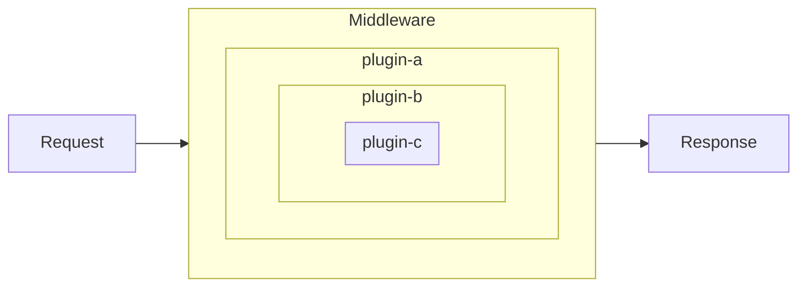

## 前言

在前端流行的框架/库的设计中，插件系统往往作为拓展其能力的重要特性。本文将参考几个流行框架/库，来探索插件系统的不同设计及区别。

## 流行框架的思路

### Koa & Redux

Koa 利用洋葱模型，通过中间件实现插件的能力。当 context 经过中间件处理后时，对 context 进行改写。

Redux 类似洋葱模型，可以通过插件将 dispatch 方法进行包装增强 dispatch 运行时的能力。

- Webpack: 通过发布订阅模式，插件使用提供的钩子进行订阅，当 Webpack 执行到该钩子时会发布消息，将订阅的插件全部执行。
- Babel: 在`代码->AST->代码`的转换过程中，提供钩子执行插件功能。插件需要声明需要处理哪些 token 及处理方式，在转换过程中会拿到正在转换的代码数据进行处理。
- ESLint:
- Vite:
- Rollup:

## 案例：为 React 组件提供插件能力
