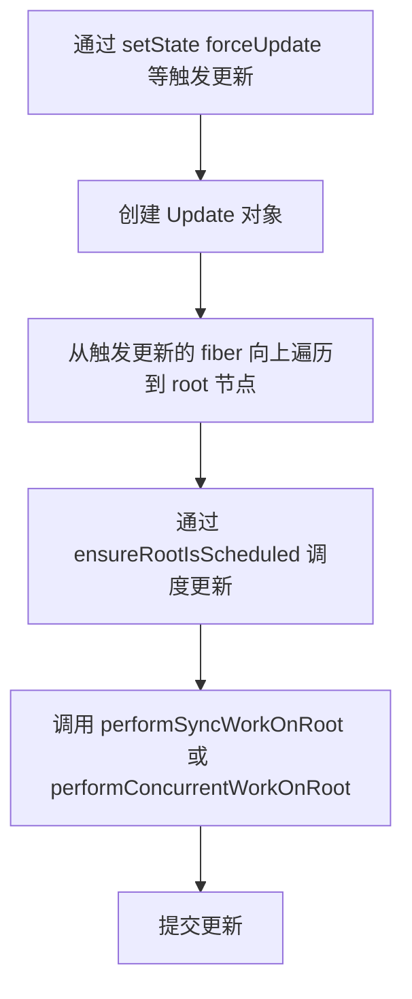

## 概念

在 React 中，通过如下方法可以触发状态更新：

- ReactDOM.render
- this.setState
- this.forceUpdate
- useState
- useReducer

### 流程

对于上述触发更新的方法，大体流程如下：



### 1. 创建更新

通过如下几种方式，构建 Update 实例提供给`scheduleUpdateOnFiber` 调度更新。

#### 1.1 this.setState

```ts
// this.setState -> this.updater.enqueueSetState
enqueueSetState(inst, payload, callback) {
  const update = createUpdate(eventTime, lane);
  update.payload = payload;

  enqueueUpdate(fiber, update, lane);
  const root = scheduleUpdateOnFiber(fiber, lane, eventTime);
}
```

#### 1.2 this.forceUpdate

```ts
// this.forceUpdate -> this.updater.enqueueForceUpdate
enqueueForceUpdate(inst, callback) {
  const update = createUpdate(eventTime, lane);
  update.tag = ForceUpdate;

  enqueueUpdate(fiber, update, lane);
  const root = scheduleUpdateOnFiber(fiber, lane, eventTime);
}
```

#### 1.3 useState/useReducer

```ts
// useState/useReducer -> setState -> dispatchAction
function dispatchAction<S, A>(
  fiber: Fiber,
  queue: UpdateQueue<S, A>,
  action: A,
) {
  const update: Update<S, A> = {
    lane,
    action,
    eagerReducer: null,
    eagerState: null,
    next: (null: any),
  };
  const alternate = fiber.alternate;

  // 根据不同流程，最终将 update 挂载到 fiber.updateQueue 上
  if (
    fiber === currentlyRenderingFiber ||
    (alternate !== null && alternate === currentlyRenderingFiber)
  ) {
    queue.pending = update;
  } else {
    if (isInterleavedUpdate(fiber, lane)) { // interleaved 意味着在 update 阶段，且是 concurrent 模式
      queue.interleaved = update;
    } else {
      queue.pending = update;
    }
    const root = scheduleUpdateOnFiber(fiber, lane, eventTime);
  }
}
```

可以看到，所有的状态更新方法，有一个一样的过程是：创建 `update`，根据不同方法打上不同的标记，然后调用 `scheduleUpdateOnFiber` 进入调度更新，即进入 `reconciliation` 和 `commit` 的流程。

#### scheduleUpdateOnFiber

```ts
export function scheduleUpdateOnFiber(
  fiber: Fiber,
  lane: Lane,
  eventTime: number,
): FiberRoot | null {
  // 从产生更新的 fiber 一直向上查找到 rootFiber 并为遍历过的 fiber 的 childLanes 打上标记
  const root = markUpdateLaneFromFiberToRoot(fiber, lane)
  if (root === null) {
    return null
  }
  if (lane === SyncLane) {
    if (
      (executionContext & LegacyUnbatchedContext) !== NoContext &&
      (executionContext & (RenderContext | CommitContext)) === NoContext
    ) {
      performSyncWorkOnRoot(root)
    } else {
      ensureRootIsScheduled(root, eventTime)
    }
  } else {
    ensureRootIsScheduled(root, eventTime)
  }

  return root
}
```

`scheduleUpdateOnFiber` 根据任务[优先级](/react/lane)，决定本次调度使用 `concurrent` 模式还是 `sync`，然后通过 `performSyncWorkOnRoot/ensureRootIsScheduled` 方法循环调用 [beginWork](/react/conciliation) 开始 `conciliation` 的工作。

### 2. 处理更新(updateQueue)

通过上述步骤，确定了待更新实例 `Update`。在后续的 `beginWork` 中，在 `ClassComponent`, `HostRoot`, `FunctionComponent` 的情况下才会出现以上 5 种产生 `Update` 的方法。

#### 2.1 对于 ClassComponent 和 HostRoot

在这两种情况下，都会调用 `processUpdateQueue` 根据优先级生成 Update，并将 Update 更新到 fiber 上。

```ts
export function processUpdateQueue<State>(
  workInProgress: Fiber,
  props: any,
  instance: any, // workInProgress.stateNode;
  renderLanes: Lanes,
): void {
  const queue: UpdateQueue<State> = (workInProgress.updateQueue: any);

  hasForceUpdate = false;

  // 上一次更新，优先级没有达到时，会将剩余的 update 存到 baseUpdate 属性中
  let firstBaseUpdate = queue.firstBaseUpdate;
  let lastBaseUpdate = queue.lastBaseUpdate;

  let pendingQueue = queue.shared.pending; // 本次等待更新的 update 链表
  if (pendingQueue !== null) { // 如果有新的 update
    queue.shared.pending = null;

    const lastPendingUpdate = pendingQueue; // pendingQueue 记录的是最后一个 update
    const firstPendingUpdate = lastPendingUpdate.next; // 由于是环状链表 update.next 则是第一个 update
    lastPendingUpdate.next = null; // 将最后一个 pendingUpdate 指向第一个的指针断开

    // 将 pendingUpdate 接在 baseUpdate 的后面
    if (lastBaseUpdate === null) {
      firstBaseUpdate = firstPendingUpdate;
    } else {
      lastBaseUpdate.next = firstPendingUpdate;
    }
    lastBaseUpdate = lastPendingUpdate;

    // 如果是更新流程，则对 current 进行同样的添加 pendingUpdate 的操作，是为了备份 updateQueue，为了在有打断更新的情况下 保留完整的 update 链表
    const current = workInProgress.alternate;
    if (current !== null) {
      const currentQueue: UpdateQueue<State> = (current.updateQueue: any);
      const currentLastBaseUpdate = currentQueue.lastBaseUpdate;
      if (currentLastBaseUpdate !== lastBaseUpdate) {
        if (currentLastBaseUpdate === null) {
          currentQueue.firstBaseUpdate = firstPendingUpdate;
        } else {
          currentLastBaseUpdate.next = firstPendingUpdate;
        }
        currentQueue.lastBaseUpdate = lastPendingUpdate;
      }
    }
  }

  // 如果当前 fiber 是否存在 update
  if (firstBaseUpdate !== null) {
    let newState = queue.baseState; // 更新基于 baseState 展开
    let newLanes = NoLanes;

    let newBaseState = null;
    let newFirstBaseUpdate = null;
    let newLastBaseUpdate = null;

    let update = firstBaseUpdate;
    do { // 遍历 update 链表
      const updateLane = update.lane;
      const updateEventTime = update.eventTime;
      if (!isSubsetOfLanes(renderLanes, updateLane)) { // 判断该 update 的更新优先级不满足本次更新的优先级
        const clone: Update<State> = {
          eventTime: updateEventTime,
          lane: updateLane,

          tag: update.tag,
          payload: update.payload,
          callback: update.callback,

          next: null,
        };
        if (newLastBaseUpdate === null) { // 将 不满足优先级的 update 克隆，并以此接在链表结构的 newBaseUpdate 中
          newFirstBaseUpdate = newLastBaseUpdate = clone;
          newBaseState = newState; // 将 baseState 更新为第一次遇到 不满足优先级的 update
        } else {
          newLastBaseUpdate = newLastBaseUpdate.next = clone;
        }
        newLanes = mergeLanes(newLanes, updateLane);
      } else { // 如果满足优先级

        // 在满足优先级，且有 baseUpdate 的情况下，说明之前产生了 不满足优先级的 update，
        // 那么需要把不满足优先级之后的 update 都记录在 baseUpdate 链表中，以保证下一次更新能拥有正确的 update 链表顺序
        if (newLastBaseUpdate !== null) {
          const clone: Update<State> = {
            eventTime: updateEventTime,
            lane: NoLane,

            tag: update.tag,
            payload: update.payload,
            callback: update.callback,

            next: null,
          };
          newLastBaseUpdate = newLastBaseUpdate.next = clone; // 接在 newBaseUpdate 后面
        }

        // 根据 updateQueue 计算出最新状态
        newState = getStateFromUpdate(
          workInProgress,
          queue,
          update,
          newState,
          props,
          instance,
        );
        const callback = update.callback; // this.setState 的第二个参数 callback
        if (
          callback !== null &&
          update.lane !== NoLane // 在 commit 阶段时，lane === NoLane ，避免 commit 阶段调用 effects
        ) {
          workInProgress.flags |= Callback;
          const effects = queue.effects;
          if (effects === null) {
            queue.effects = [update];
          } else {
            effects.push(update); // 将 callback 存入 updateQueue.effects
          }
        }
      }
      update = update.next;
      if (update === null) { // 当遍历到最后一个 update 时
        pendingQueue = queue.shared.pending; // 检查是否还有新的 update ， 如在 setState 中 又调用了 setState 则又会向 shared.pending 中加入新的 update
        if (pendingQueue === null) { // 结束循环
          break;
        } else { // 处理又添加的 update
          const lastPendingUpdate = pendingQueue;
          const firstPendingUpdate = ((lastPendingUpdate.next: any): Update<State>);
          lastPendingUpdate.next = null;
          update = firstPendingUpdate;
          queue.lastBaseUpdate = lastPendingUpdate;
          queue.shared.pending = null;
        }
      }
    } while (true);

    if (newLastBaseUpdate === null) { // baseUpdate 为null ，说明本次 update 优先级都满足要求并处理完毕了，baseState 更新为 最终的 newState
      newBaseState = newState;
    }

    // 更新 fiber.updateQueue
    queue.baseState = ((newBaseState: any): State);
    queue.firstBaseUpdate = newFirstBaseUpdate;
    queue.lastBaseUpdate = newLastBaseUpdate;

    const lastInterleaved = queue.shared.interleaved;
    if (lastInterleaved !== null) {
      let interleaved = lastInterleaved;
      do {
        newLanes = mergeLanes(newLanes, interleaved.lane);
        interleaved = ((interleaved: any).next: Update<State>);
      } while (interleaved !== lastInterleaved);
    } else if (firstBaseUpdate === null) {
      queue.shared.lanes = NoLanes;
    }

    markSkippedUpdateLanes(newLanes);
    workInProgress.lanes = newLanes;
    workInProgress.memoizedState = newState; // 将最终结果赋值给 memoizedState
  }
}
```

#### 对于 FunctionComponent

在 FunctionComponent 中，状态是记录在 hooks 中的。

```ts
function updateReducer<S, I, A>(
  reducer: (S, A) => S,
  initialArg: I,
  init?: I => S,
): [S, Dispatch<A>] {
  const hook = updateWorkInProgressHook();
  const queue = hook.queue;

  if (queue === null) {
    throw new Error(
      'Should have a queue. This is likely a bug in React. Please file an issue.',
    );
  }

  queue.lastRenderedReducer = reducer;

  const current: Hook = (currentHook: any);

  let baseQueue = current.baseQueue;

  const pendingQueue = queue.pending;
  if (pendingQueue !== null) {
    if (baseQueue !== null) {
      const baseFirst = baseQueue.next;
      const pendingFirst = pendingQueue.next;
      baseQueue.next = pendingFirst;
      pendingQueue.next = baseFirst;
    }
    current.baseQueue = baseQueue = pendingQueue;
    queue.pending = null;
  }

  if (baseQueue !== null) {
    const first = baseQueue.next;
    let newState = current.baseState;

    let newBaseState = null;
    let newBaseQueueFirst = null;
    let newBaseQueueLast = null;
    let update = first;
    do {
      const updateLane = update.lane;
      if (!isSubsetOfLanes(renderLanes, updateLane)) {
        const clone: Update<S, A> = {
          lane: updateLane,
          action: update.action,
          hasEagerState: update.hasEagerState,
          eagerState: update.eagerState,
          next: (null: any),
        };
        if (newBaseQueueLast === null) {
          newBaseQueueFirst = newBaseQueueLast = clone;
          newBaseState = newState;
        } else {
          newBaseQueueLast = newBaseQueueLast.next = clone;
        }
        currentlyRenderingFiber.lanes = mergeLanes(
          currentlyRenderingFiber.lanes,
          updateLane,
        );
        markSkippedUpdateLanes(updateLane);
      } else {

        if (newBaseQueueLast !== null) {
          const clone: Update<S, A> = {
            lane: NoLane,
            action: update.action,
            hasEagerState: update.hasEagerState,
            eagerState: update.eagerState,
            next: (null: any),
          };
          newBaseQueueLast = newBaseQueueLast.next = clone;
        }

        if (update.hasEagerState) {
          newState = ((update.eagerState: any): S);
        } else {
          const action = update.action;
          newState = reducer(newState, action);
        }
      }
      update = update.next;
    } while (update !== null && update !== first);

    if (newBaseQueueLast === null) {
      newBaseState = newState;
    } else {
      newBaseQueueLast.next = (newBaseQueueFirst: any);
    }

    if (!is(newState, hook.memoizedState)) {
      markWorkInProgressReceivedUpdate();
    }

    hook.memoizedState = newState;
    hook.baseState = newBaseState;
    hook.baseQueue = newBaseQueueLast;

    queue.lastRenderedState = newState;
  }

  const lastInterleaved = queue.interleaved;
  if (lastInterleaved !== null) {
    let interleaved = lastInterleaved;
    do {
      const interleavedLane = interleaved.lane;
      currentlyRenderingFiber.lanes = mergeLanes(
        currentlyRenderingFiber.lanes,
        interleavedLane,
      );
      markSkippedUpdateLanes(interleavedLane);
      interleaved = ((interleaved: any).next: Update<S, A>);
    } while (interleaved !== lastInterleaved);
  } else if (baseQueue === null) {
    queue.lanes = NoLanes;
  }

  const dispatch: Dispatch<A> = (queue.dispatch: any);
  return [hook.memoizedState, dispatch];
}
```
